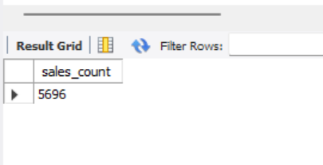
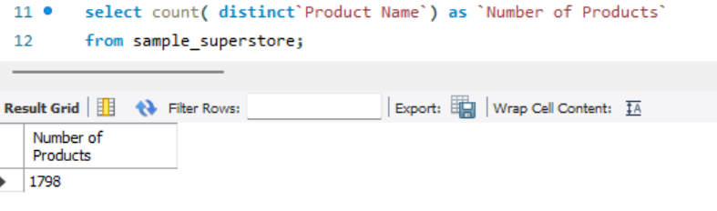

## Aggregate Functions

### Introduction:
one of the fundamental aspects of database management is the ability to effectively analyze and aggregate data within tables. This task serves as a guide to understanding the aggregate functions in SQL, including SUM, COUNT, AVERAGE, MIN, and MAX.

### Problem statement:

1. How many rows are in the SALES table provided? 

2. The business is operating in how many regions?

3. What is the total profit generated in the WEST region?

4. What is the average profit generated from the sales of the company’s product?

5. On average, how many days dies it take for a customer to get their orders shipped? Create a new column (Days_to_ship)

6. How many products does the company sell?

7. Show the names and cities of the 5 customers who contributed most to the overall profit. 

8. Show the sales generated by cities where total sakes is > 20000

### Result/Discussion:

#### Number of rows in the sales column from the sample_superstore:

From the screenshot above, it shows the total number of rows in the SALES table and the syntax used is;

_SELECT COUNT(*) FROM SALES;_

#### Total number of regions from the sample_superstore:

The snapshot provided above shows the number of regions in which the business is operating and the command used is;

_SELECT COUNT(DISTINCT region) FROM SALES;_

#### Total profits generated in the West region:

The snapshot above displays the total profit generated in the West region and the syntax is as follows; 

_SELECT SUM(profit) AS sum_profit
FROM SALES
WHERE region = 'WEST';_

#### Average profit 

This snapshot shows the query of average profit generated from the company's product sales and the command used is; 

_SELECT AVG(profit) AS average_profit
FROM SALES;_

#### Average number of days

The screenshot above displays the average number of days it takes for a customer to get their orders shipped and the syntax used includes;

#### Add the new column "Days_to_ship" to your table:

_ALTER TABLE table_name
ADD Days_to_ship INT;_

#### Update the new column with the calculated values for each row:

_UPDATE your_table_name
SET Days_to_ship = DATEDIFF(ship_date, order_date);_

#### Calculate the average shipping day:

_SELECT AVG(Days_to_ship) AS average_shipping_time
FROM your_table_name;_

#### Number of products:

The provided screenshot shows the number of different products the company sells and the command used is;

_SELECT COUNT(DISTINCT product) AS product_count
FROM SALES;_

#### Top_5_Customers

The screenshot above indicates the data by customer name and city, calculates the total profit for each customer, and then orders the results in descending order of profit. Finally, it limits the output to the top 5 customers who contributed the most to the overall profit, and the syntax used is;

_SELECT customer_name, customer_city
FROM SALES
GROUP BY customer_name, customer_city
ORDER BY SUM(profit) DESC
LIMIT 5;_

#### Total sales for each City

The snapshot above indicates the data by city, calculates the total sales for each city, and then filters the results to include only those cities where the total sales are greater than $20,000 and the syntax used is;

_SELECT city, SUM(sales) AS total_sales
FROM SALES
GROUP BY city
HAVING SUM(sales) > 20000;_

### Conclusion:

these tasks have provided a comprehensive exploration of the SALES table through SQL. 
The total number of rows in the table was determined, followed by identifying the number of regions in which the business operates. 
Total profit was calculated in the West region and the average profit from product sales. Additionally, the count of different products sold by the company was determined.

Furthermore, highlighting the top 5 customers with overall profit was analyzed. 

Lastly, sales data for cities with total sales exceeding $20,000 were filtered. These tasks collectively demonstrate the power of SQL in extracting valuable insights from a dataset for informed decision-making.
